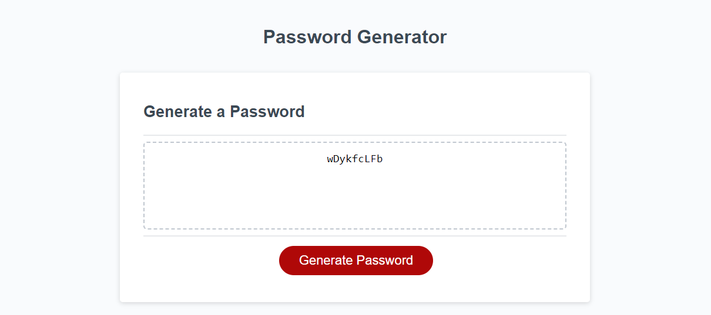

# Password Generator

This is a password generator. On clicking the password generator button, the user will be prompted choose a password length between 8 and 128, and then will be asked to confirm four prompts (lowercase, uppercase, numbers and special characters). At the completion of these prompts, the user will be shown their unique, randomly-generated password.

# Link to deployed website
https://999888z.github.io/Password-Generator/

# Screenshot of application

